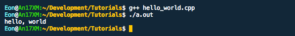

# Hello, World

A _classic_ example of a very basic computer program, is a **Hello World** Program.


All we have to do, is print "hello, world" on the screen.
By running such a simple code, we an test if the compiler is installed properly and you understand how to use it. (Atleast to a certain level)

Let's start with the code, and we'll deconstruct it after you run it for the first time.

```c++
#include <iostream>

int main() {

    // Print hello, world
    std::cout << "hello, world" << std::endl;

    return 0;
}
```

Simply type this code into a file, say `hello_world.cpp` and save it.
We shall compile it using `g++`.

Open a terminal in the folder where the file is saved, and type the following in it.

```bash
g++ hello_world.cpp
```

You'll see a new file `a.out` is created in the folder. This is the executable file for the program we just compiled. To run it, type:

```bash
./a.out
```

You'll see an output in the line below



Tada! You have your first program!

Okay, now the line by line explanation

```cpp
#include <iostream>
```
Includes (i.e. copies the text from) a file called iostream that's stored on your system. The following lines contain constructs whose definition is in this file
```cpp
int main() {
```
- We are creating a main function where the program starts.
- `int`? The type of data we are going to return (For `main`, it's always `int`.) We'll talk about this in the variables chapter. Datatypes simply tell what kind of data it is (`int` implies an Integer data)
- Braces `{` Denote that all the lines between the braces belong to main. It is called a _block_.
```cpp
std::cout << "hello, world" << std::endl;
```
- `std::cout` is what you use to send output to the terminal.
- `"hello, world"` a string inside `"` that you send to `std::cout` to be printed.
- `std::endl` tells the `std::cout` that this line is done, print this, and go to the next line. _Experiment by removing this part and check._
- The `<<` between them can are _stream operators_. For now think of them as operators that move the data into `std::cout`

> **Note:** You'll see only `cout` written sometimes. This will be in codes where this is also a line `using namespace std;` we do not write this in our codes, but will introduce it later.

```cpp
return 0;
```
- The `int` in `int main` referse to the datatype of what you return. And the return statement actually returns a value.
- So in this case we return a `0` which marks a successful execution.
- This is where the `main` logically ends. However we need to complete the block and add the last `}` after this.

That completes the breakdown of the program.
Feel free to modify slightly every part of the code and see what changes/breaks.

Since I learnt through experimentation, I advise everyone to try it.

Then you can see the [next chapter](4_Variables.md)!
